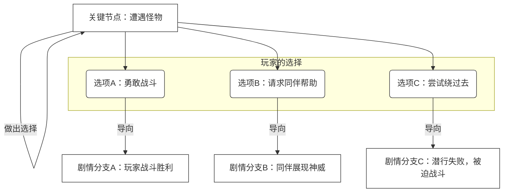
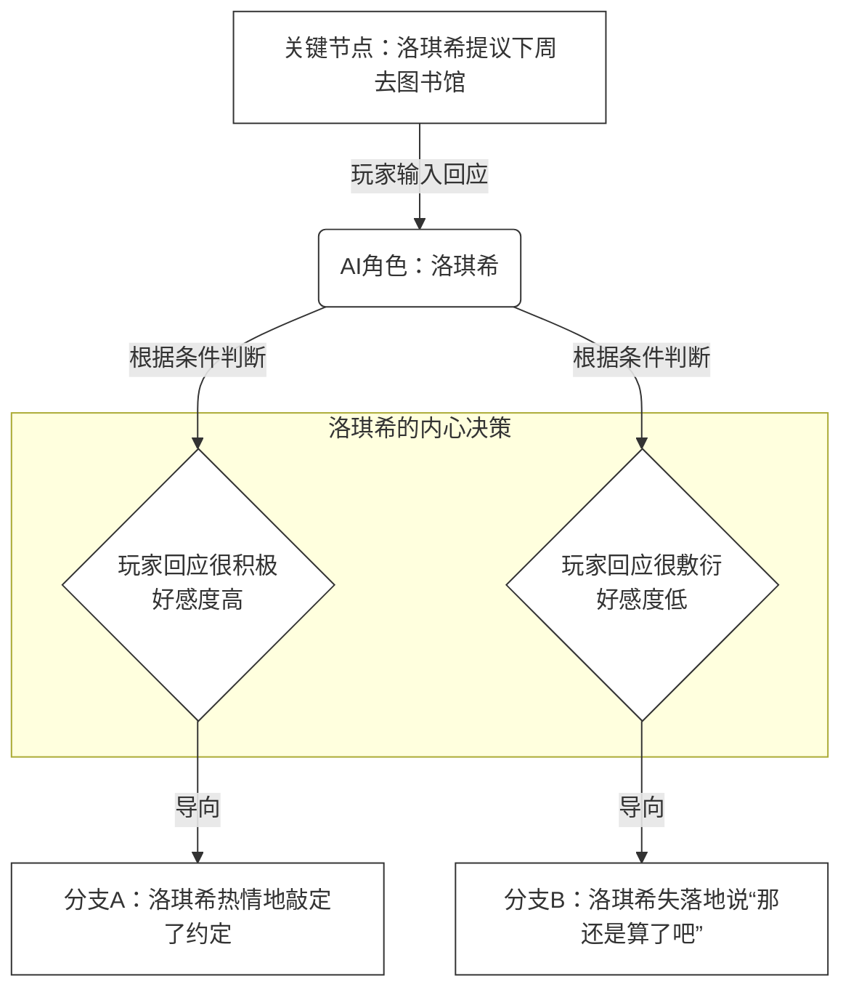

# NeoChat 剧情创作指南：打造你的互动AI故事

欢迎来到 NeoChat 的世界！在这里，我们不仅仅是与 AI 对话，更是与 AI 共同创作和体验故事。本指南将教你如何使用 NeoChat 强大而灵活的剧情引擎，从一个简单的想法开始，一步步构建出拥有丰富分支、动态事件和鲜活角色的互动叙事体验。

无论你是一位经验丰富的作家，还是一位充满热情的游戏设计爱好者，甚至只是想让你的原创角色（OC）在故事中活过来，本指南都将为你提供所需的全部工具。

## 第一部分：剧情设计的艺术 (概念篇)

在触摸任何代码之前，让我们先来聊聊故事本身。一个好的互动故事，就像一部电影或一本小说，需要精心设计的结构。在 NeoChat 中，我们的基本构件是 **剧情单元 (Story Unit)**。

你可以把一个“剧情单元”想象成故事中的一个**独立场景**或**一个片段**。比如：

*   “在放学后的教室里与同桌对话”
*   “在阴森的地下城探索一条岔路”
*   “在咖啡馆里的一次偶然邂逅”

你的整个故事，就是由许许多多这样的“剧情单元”串联起来的。而连接它们的方式，决定了你的故事是线性、分支还是动态的。

### 1. 线性故事：经典的叙事

这是最简单的结构，像一条直线，从头走到尾。适用于讲述一个有固定情节的故事，或者作为复杂故事的开端和结尾。


**设计思路**：当你希望玩家按照你设定的节奏体验一个完整、连贯的情节时，就使用线性连接。

### 2. 分支故事：选择的力量

这是互动故事的魅力所在。在一个关键节点，玩家的选择将决定故事的走向。



**设计思路**：在你希望赋予玩家决策权，让他们感受到自己的选择能够真正影响世界时，就设置分支。这可以是明确的选项，也可以是玩家的自由输入。

### 3. AI 决策故事：不可预测的伙伴

这才是 NeoChat 的真正进化之处！故事的走向不再仅仅由你或玩家决定，**故事中的AI角色也有自己的“想法”**。

AI 角色会根据你们之前的对话、TA对你的好感度、或者一些隐藏的随机因素，自己做出决定，从而推动故事进入一个意想不到的分支。



**设计思路**：当你希望故事中的伙伴看起来更“真实”、更有“灵魂”时，就把决策权交给 AI。这会让玩家感觉他们是在和一个活生生的人互动，而不是在玩一个程序。

### 4. 循环与随机故事：无尽的冒险

想做一个可以反复游玩的地下城探索，或者一个充满随机事件的日常故事吗？循环结构是你的好朋友。通过将几个剧情单元首尾相连，并加入随机事件，你可以创造出“无限”的体验。

```mermaid
graph TD
    %% 核心修改：定义一个名为 'default' 的全局样式类
    %% fill:填充色, stroke:边框色, color:文字颜色
    classDef default fill:#fff,stroke:#333,color:#333

    Start[迷宫入口] --> A[进入新区域]

    subgraph 核心探索循环 direction TD
        A --> Decision{投骰子判定}
        Decision --> Treasure(发现宝藏)
        Decision --> Monster(遭遇怪物)
        Decision --> Trap(踩到陷阱)

        Treasure --> EventOver(事件结束后)
        Monster --> EventOver
        Trap --> EventOver
        
        EventOver --> A
    end

    Decision --> ExitCondition{"满足特定条件?<br/>(如到达5层)"}
    ExitCondition --> End[找到出口]
```

**设计思路**：适用于 roguelike 游戏、TRPG 跑团、随机事件生成器等。玩家的每一次体验都会因为随机性而变得独一无二。

### 5. 自由时间：让故事“暂停”一下

有时候，我们不希望被剧情推着走。我们想停下来，和身边的角色聊聊天，谈谈心事，或者就刚刚发生的事情交换一下看法。**自由时间 (FreeTime)** 模式就是为此而生。

在自由时间里，主线剧情会暂时停止，你可以和 AI 角色进行无限制的开放式对话。当你说出某个关键词（比如“我们继续走吧”）或者对话达到一定轮次后，主线剧情才会继续。

这极大地增强了代入感和与角色的情感连接。

---

## 第二部分：NeoChat 的语言：精通 YAML

现在，让我们把上面那些精彩的设计图，变成机器能看懂的语言。NeoChat 使用 `YAML` 格式来编写剧本，它非常简洁，比代码更易读。

### 剧本包结构

一个完整的剧本包（Story Pack）是一个文件夹，它包含以下内容：

```text
roxy_labyrinth_adventure/       # 剧本包根目录
├── story/                      # 存放所有“剧情单元”文件
│   ├── 00_Labyrinth_Entrance.yaml
│   ├── 01_Explore_Corridor.yaml
│   └── ...
├── save/                       # 存放剧本的初始状态
│   └── gamestate.yaml
├── character/                  # 存放本剧本默认角色的设定文件（可选）
│   └── Roxy.yaml
├── 全局剧情配置.yaml           # 剧本的“身份证”
└── 剧情介绍.md                 # 在游戏菜单中展示给玩家的介绍
```

### 剧情单元 (`.yaml`) 的解剖

每个 `.yaml` 剧情单元文件主要由两部分构成：`Events`（事件列表）和 `EndCondition`（结束条件）。

#### 1. `Events`: 故事的每一句话

`Events` 是一个列表，包含了这个场景中发生的所有事情，引擎会按顺序逐一执行。

**事件类型 (Type)**

* **`Narration` (旁白)**: 描述环境、动作或内心活动。

  ```yaml
  # 预设旁白
  - "Type: Narration | Mode: Preset": '你和洛琪希老师站在巨大的地下迷宫入口。'
  
  # AI生成的旁白
  - "Type: Narration | Mode: Prompt": '你是一个游戏旁白。请描述他们进入一个新的洞穴所见的场景。'
  ```

* **`Dialogue` (对话)**: 角色说的话。

  ```yaml
  # 预设对话
  - "Type: Dialogue | Character: Roxy | Mode: Preset": '“{player_name}さん，一定要跟紧我。”'
  
  # AI生成的对话
  - "Type: Dialogue | Character: Roxy | Mode: Prompt": '你的内心活动：看到玩家鲁莽地冲上去，你很担心，请说一句话提醒他。'
  ```

* **`Player` (玩家)**: 属于玩家的行动。

  ```yaml
  # 强制玩家说的话 (剧情杀)
  - "Type: Player | Mode: Preset": '我准备好了！'
  
  # 等待玩家自由输入
  - "Type: Player | Mode: Input": '（你观察着四周，决定下一步的行动。你要做什么？）'
  ```

  > **核心技巧**：当使用 `Player | Mode: Input` 时，玩家的输入内容会被临时存放在一个叫 `{player_input}` 的变量里，可以立刻被下一个事件使用！

* **`Notice` (公告)**: 用于显示系统消息、规则说明等，通常是多行文本。

  ```yaml
  - "Type: Notice | Mode: Preset | Location: popup": '探险结束！\n击败怪物数量: {monsters_defeated}'
  ```

* **`Chapter` (章节)**: 在对话记录中插入一个章节标记，方便前端显示。

  ```yaml
  - "Type: Chapter | Mode: Preset":
      Title: "序章：未知的呼唤"
      Description: "古老的石门缓缓开启..."
  ```

* **`Action` (动作)**: **这是实现动态故事的魔法！** 它在后台默默地修改游戏状态（`gamestate.yaml`），但玩家看不到。

  * **`Set`**: 设置一个变量的值。

    ```yaml
    - "Type: Action | Tool: Set | Variable: has_torch":
        Value: true
    ```

  * **`Calculate`**: 进行数学计算。

    ```yaml
    - "Type: Action | Tool: Calculate | Variable: player_hp":
        Expression: "{player_hp} - 10"
    ```

  * **`Random`**: 生成一个随机数。

    ```yaml
    - "Type: Action | Tool: Random | Variable: dice_roll":
        Min: 1
        Max: 20
    ```

  * **`RandomChoice`**: 从列表中随机选择一个。

    ```yaml
    - "Type: Action | Tool: RandomChoice | Variable: monster_type":
        Choices: ["哥布林", "史莱姆", "骷髅兵"]
    ```

* **`Condition` (条件块)**: 只有当满足特定条件时，才会执行里面的 `Events`。

  ```yaml
  - Condition: "{dice_roll} > 15"  # 只有当骰子点数大于15
    Events:
      - "Type: Narration | Mode: Preset": '你成功躲开了陷阱！'
      - "Type: Action | Tool: Calculate | Variable: traps_disarmed":
          Expression: "{traps_disarmed} + 1"
  ```

#### 2. `EndCondition`: 下一站去哪里？

当一个剧情单元的 `Events` 全部执行完毕后，`EndCondition` 会告诉引擎接下来该做什么。

* **`Linear` (线性)**: 直接跳到下一个指定的剧情单元。

  ```yaml
  EndCondition:
    Type: Linear
    NextUnitID: '01_Explore_Corridor' # 下一个单元的文件名(不含.yaml)
  ```

* **`Branching` (分支)**:

  * **`PlayerChoice` (玩家选择)**: 显示选项让玩家选择。

    ```yaml
    EndCondition:
      Type: Branching
      Method: PlayerChoice
      Branches:
        A: { DisplayText: '我来对付它！', NextUnitID: '03A_Player_Fights' }
        B: { DisplayText: '老师，拜托你了！', NextUnitID: '03B_Roxy_Fights' }
    ```

  * **`AIChoice` (AI选择)**: 让AI来做决定。

    ```yaml
    EndCondition:
      Type: Branching
      Method: AIChoice
      DeciderCharacterID: "Roxy" # 决定者
      DecisionPromptForAI: "内心活动：根据刚才和{player_name}的对话，你决定是'同意'还是'拒绝'他的请求？"
      JudgePromptForSystem: "你是系统。判断AI的回答是同意(A)还是拒绝(B)。只输出A或B。"
      Branches:
        A: 'Agreement_Unit'
        B: 'Rejection_Unit'
    ```

* **`Conditional` (条件)**: 根据游戏变量的值自动判断走向。

  ```yaml
  EndCondition:
    Type: Conditional
    Cases:
      - Condition: "{favorability_Roxy} >= 80"
        Then: { Type: Linear, NextUnitID: 'Good_Ending' }
      - Condition: "{favorability_Roxy} >= 50"
        Then: { Type: Linear, NextUnitID: 'Normal_Ending' }
    Else:
      Type: Linear
      NextUnitID: 'Bad_Ending'
  ```

* **`FreeTime` / `LimitedFreeTime` (自由时间)**: 暂停主线，进入自由聊天模式。

  ```yaml
  EndCondition:
    Type: LimitedFreeTime
    MaxTurns: 5 # 最多聊5轮
    InstructionToPlayer: "你可以和洛琪希自由交谈，说“我们走吧”继续探险。"
    ExitPromptInInputBox: "我们走吧" # 退出语
    NextUnitID: '01_Explore_Corridor' # 结束后去往的单元
  ```

---

## 第三部分：实战演练：构建《与洛琪希的地下迷宫探险》

让我们通过分析这个剧本，看看所有概念是如何组合在一起的。

### 场景一：迷宫入口 (`00_Labyrinth_Entrance.yaml`)

这是一个典型的 **线性** 开场。

1.  **Events**: 使用 `Chapter`, `Narration`, `Dialogue` 依次交代了背景和角色对话。
2.  **关键点**: 最后是一个 `Player | Mode: Input` 事件，让玩家说出第一句话，增强代入感。
3.  **EndCondition**: 类型是 `Linear`，无论玩家说什么，剧情都会无缝衔接到下一个单元 `01_Explore_Corridor`。

### 场景二：核心探索循环 (`01_Explore_Corridor.yaml`)

这是 **循环与随机** 设计的绝佳范例。

1.  **Events**:
    *   `Action: Calculate`: 楼层数+1。
    *   `Narration: Prompt`: AI随机生成一段新的场景描述，让每次探索都不同。
    *   `Dialogue: Prompt`: 洛琪希根据新场景做出反应，显得很智能。
    *   `Player: Input`: 将行动权交给玩家。
    *   `Action: Set`: **用 `{player_input}` 捕获玩家的行动**，存入 `player_last_action` 变量。
    *   `Action: Random`: 投一个20面的骰子，存入 `dice_roll` 变量。
2.  **EndCondition**:
    *   类型是 `Conditional`，它会检查 `dice_roll` 的值。
    *   如果点数高，就进入“宝藏事件” (`02_Event_Treasure`)。
    *   如果点数中等，就进入“怪物事件” (`03_Event_Monster`)。
    *   如果点数低，就进入“陷阱事件” (`04_Event_Trap`)。
    *   无论进入哪个事件，这些事件的结尾都会通过 `Linear` EndCondition **再次连接回 `01_Explore_Corridor.yaml`**，从而形成一个无限循环的探索流程。

### 场景三：玩家战斗 (`03A_Player_Fights.yaml`)

这个单元展示了如何让玩家的输入**真正影响 AI 的反馈**。

1.  **Events**:
    *   `Player: Input`: 玩家输入他想如何攻击怪物。
    *   `Action: Set`: 捕获玩家的攻击方式到 `player_last_action`。
    *   `Narration: Prompt`: 这个旁白的 Prompt **包含了 `{player_last_action}`**！AI 会根据“玩家的攻击方式”来描述战斗场面，而不是胡编乱造。
    *   `Dialogue: Prompt`: 洛琪希的夸奖 Prompt **也包含了 `{player_last_action}`**。她会说“你刚才那招真帅！”，而不是泛泛地说“你真厉害”。这让她的夸奖显得无比真诚。

---

**总结**

现在你已经掌握了 NeoChat 剧情创作的核心思想和工具。记住以下几点：

*   **先设计，再实现**：用思维导图规划好你的故事结构。
*   **拆分场景**：将故事拆解成一个个独立的“剧情单元”。
*   **善用 `Action` 和 `{变量}`**：这是让你的故事“活”起来的关键，用它们来记录状态，影响剧情。
*   **巧用 `Prompt`**：不要让 AI 天马行空，用明确的指示和 `{变量}` 来约束 AI，让它为你服务，生成你想要的内容。

现在，打开你的文本编辑器，开始创作属于你和 AI 的独一无二的冒险吧！