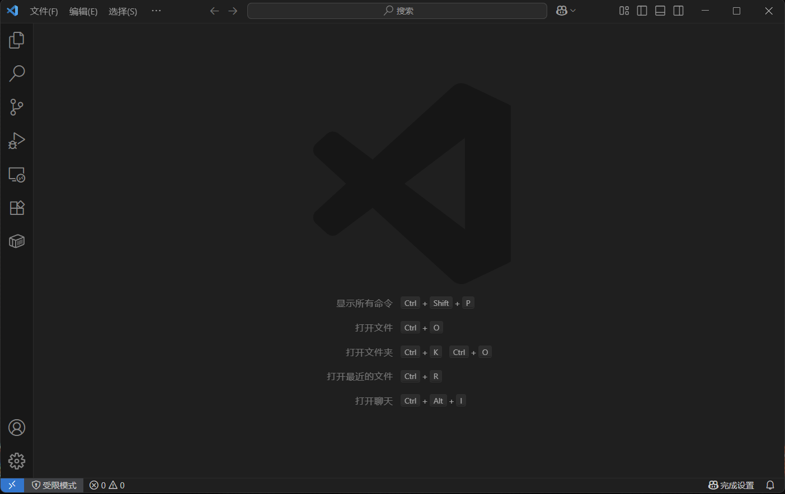
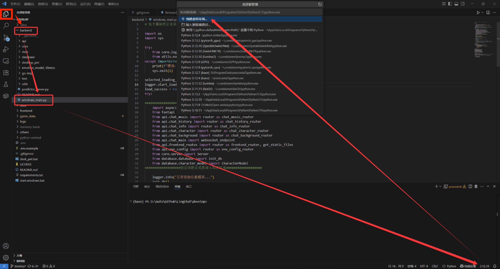
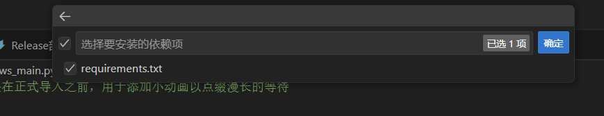
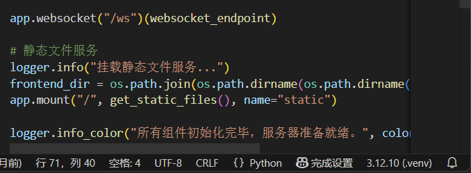
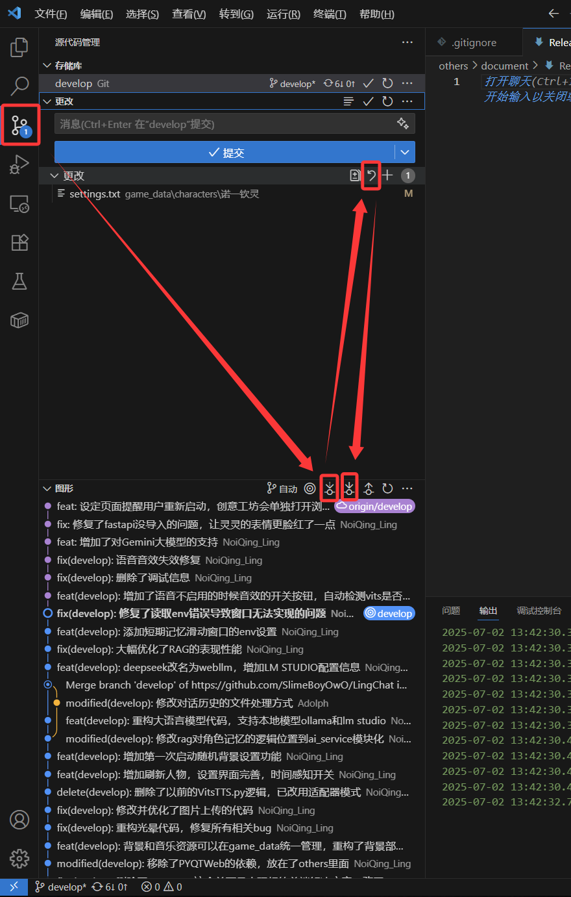

# LingChat 开发版 Windows 环境配置与使用指南

LingChat 几乎每天都在更新，但是很长时间才会发布一个 release 版本。如果你想抢先使用新功能，或者想为 LingChat 项目做贡献，但是自己不会写代码，我们也欢迎你体验最新的开发版并及时向我们汇报 Bug。

本篇文档将手把手教你如何在 Windows 电脑上，从零开始配置环境，运行 LingChat 最新的开发版代码。即使你完全不懂编程。

欢迎你，勇于探索的测试者！


## 零、准备工作：安装必备工具

在开始之前，我们需要在你的电脑上安装三个免费的代码开发工具。

### 1. 安装 Git

Git是一个代码版本管理工具，我们在这里用它链接GitHub，下载和更新GitHub中的源代码。

- **下载地址**：[https://git-scm.com/download/win](https://git-scm.com/download/win)
- **安装方法**：下载后，双击打开安装包，**一路点击 "Next"** 使用默认设置完成安装即可。

### 2. 安装 Python

Python 是 LingChat 使用的编程语言。

- **下载地址**：[https://www.python.org/downloads/](https://www.python.org/downloads/)
- **推荐版本**：建议下载[3.12.10]([Python Release Python 3.12.10 | Python.org](https://www.python.org/downloads/release/python-31210/))版本，LingChat是基于python 3.12.10 开发的。在这里选择适合你系统的安装包。


- **安装方法**：
    1.  下载后，双击打开安装包。
    2.  **【非常重要！】** 在安装界面的最下方，**务必勾选 "Add Python to PATH"** 选项，然后再点击 "Install Now"。
    3.  等待安装完成即可。

### 3. 安装 VS Code

VS Code是最主流的代码编辑器，界面现代，运行速度快，我们将用它来查看、管理和运行LingChat的源代码。

- **下载地址**：[https://code.visualstudio.com/](https://code.visualstudio.com/)
- **安装方法**：下载后，双击打开安装包。同样，使用默认设置，一路点击 "Next" 完成安装。

## 一、获取最新的源代码

准备工作完成后，我们开始获取 LingChat 的源代码。

1.  **创建项目文件夹**：在你的电脑上找到你想要的位置（比如 D 盘），创建一个新文件夹来存放源代码，我们以命名为 `MyProjects`为例。

2.  **打开命令行工具**：
    
    -   进入你刚刚创建的 `MyProjects` 文件夹。
    -   在文件夹窗口的地址栏里，输入 `cmd` 然后按回车键。这会弹出一个黑色的命令行窗口。
    
3.  **使用git命令下载代码**：在弹出的黑色窗口中，复制并粘贴以下命令，然后按回车键。

    ```bash
    git clone -b develop https://github.com/SlimeBoyOwO/LingChat.git
    ```

    -   `git clone` 是下载命令。
    -   `-b develop` 表示我们要下载 `develop` 分支（也就是最新的开发版）。

    当你看到命令行提示完成，并且 `MyProjects` 文件夹下出现了一个名为 `LingChat` 的新文件夹时，就说明代码已经成功下载到你的电脑里了！

## 二、使用 VS Code 配置和运行项目

### 2.1 初始化vscode设置

现在，我们将使用 VS Code 来完成最后的配置和运行。



打开你安装好的vs code，如果不习惯英文界面，可以百度：“vscode如何设置中文”，将界面设置为中文。下面我们基于中文界面讲解。


LingChat是一个python项目，所以我们要给VS code安装Python插件。在左侧打开插件栏并搜索python，安装Python和Pylance，然后把软件重启即可。

### 2.2 使用VS Code 打开LingChat

在VS Code的左上角，找到"文件"选项，然后点击"打开文件夹..."(如果你使用的是英文界面，则是点击"File" -> "Open Folder...")，导航到刚刚下载的 `LingChat` 文件夹，然后点击 "选择文件夹"。现在你就成功的用VS Code打开了LingChat，在这之后，你可以在"文件"选项的“打开最近的文件”来快速找到LingChat。



点击最左上角的两张A4纸图标进入文件视图，点击“backend”展开后端文件，然后点击window_main.py，就可以在vscode里打开项目的入口代码。

### 2.3 创建隔离的Python运行环境

现在你打开了window_main.py。.py代表这是一段Python代码，他需要运行在自己的Python环境中。现在我们来为LingChat的python创建一个隔离的独立Python运行环境。

耐心等待一分钟，VS code的右下角会显示3.12.10，这是你电脑上安装的python的版本号。

- 如果等待了很久也没有看到python的版本号，请检查你现在打开的是否是.py结尾的文件
- 如果确认自己打开的是.py结尾的文件（右下角能看到{}Python标志），等待了很久仍然没有出现版号，说明你安装的Python没有添加到系统路径，导致无法被VS code识别到。请重新安装，安装时记得勾选"Add Python to PATH"。

点击这个版本号，再点击上方的“创建虚拟环境”，就可以依据我们的python在LingChat的文件夹里面创建一个文件夹，里面放LingChat的运行环境。


点击这个Python3.12.10，这是LingChat使用的python版本。



勾选“requirements.txt”，然后耐心等待吧。你的电脑开始为LingChat创建他的独立虚拟环境，这个过程可能会长达20分钟。



在虚拟环境安装成功并激活后，右下角显示将会多了一个(.venv)，这说明项目已经使用.venv虚拟环境打开啦，他就在你LingChat文件夹的.venv文件夹里。

现在，你可以点击右上角，使用VS code运行LingChat的源代码，也可以双击start.windows.bat来方便的快速打开lingchat。

## 三、获取最新的更新

LingChat 几乎每天都在更新，你可以随时查看并使用最新的更新。



点击左侧按钮进入查看更新界面。点击虚线箭头刷新近期的更新，然后点击那个撤销箭头——这会让你对LingChat的所有改动都被撤销，保证不会产生冲突。如果你像这样更新了人物设定，可以自己把他复制出来备份一下，然后点击撤销。

最后点击实线箭头，就可以把LingChat更新到最新版本啦！


## 四、常见问题 (FAQ)

-   **Q: 输入 `git` 或 `python` 命令时，提示“不是内部或外部命令...”？**
    A: 这说明 Git 或 Python 没有被正确安装，或者安装时忘记勾选 "Add to PATH"。请回到【准备工作】章节，卸载后重新安装，**务必记得勾选 "Add to PATH" 选项**。

-   **Q: 运行 `python main.py` 时报错 `ModuleNotFoundError: No module named 'xxxx'`？**
    A: 这个错误说明缺少某个库。通常有两个原因：
    
    1.  你忘记激活虚拟环境了。请检查终端提示符前面是否有 `(venv)` 字样，如果没有，请执行 `.\venv\Scripts\activate`。
    2.  缺少部分依赖。请执行 `.\venv\Scripts\activate`，然后，执行 `pip install xxxx`。
    
-   **Q: `git pull` 更新代码时提示错误或冲突 (conflict) 怎么办？**
    A: 作为测试者，你本地的代码一般不需要修改。如果遇到冲突，最简单的办法是放弃本地的所有改动，强制和服务器保持一致。在终端执行以下命令：
    
    ```powershell
    git reset --hard origin/develop
    git pull
    ```
    **注意：这个命令会丢弃你可能在本地做的任何修改，请及时备份** 对于只想体验最新版的用户来说，这是最直接有效的方法。

---

感谢你为 LingChat 做出的贡献！如果你在使用过程中发现了任何 Bug 或者有好的建议，欢迎随时向我们提 [Issue](https://github.com/SlimeBoyOwO/LingChat/issues)！
